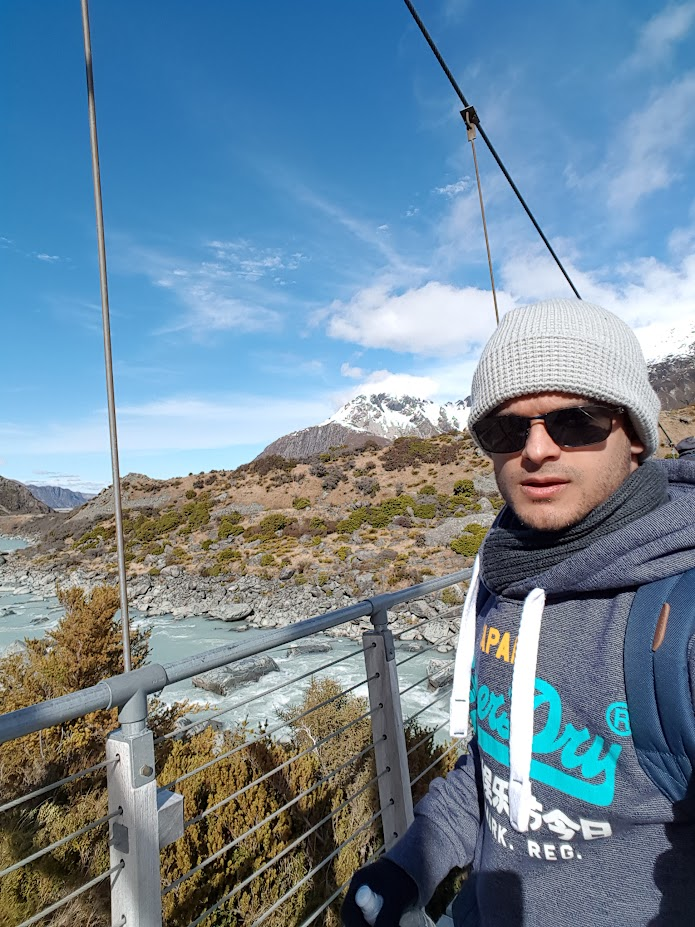

## Hello, I'm Tejas

I am a DevOps Engineer with 7+ years of experience in automating and optimizing mission-critical deployments over small and large infrastructure. Proficient with Linux and virtualization, I have a strong background in cloud services like OpenStack, with experience in public cloud platforms like Microsoft Azure and Google Cloud Platform. I am passionate about building scalable and efficient technology solutions.

### Professional Background

- **Senior DevOps Infrastructure Engineer** at Thales, Melbourne (2023-present)
  - Development of in-house tool built using Ansible to deploy and configure new on-premise platforms for air traffic control subsystems.
  - Build validation controls using Inspec to audit infrastructure configurations and compliance with security baselines.
  - Support virtualised and site platforms with hardware or configuration issues, by being able to replicate on test platforms and validate bug fixes in lab environments.
- **Senior Technical Consultant** at DXC Technology, Melbourne (2022-2023)
  - Supported Red Hat OpenStack platform enabling development teams at a government client.
  - Prepared new hardware for ingestion in OpenStack platform to scale out platform enabling developer teams to onboard new projects for critical applications.
  - Performed troubleshooting and fixes for OpenStack platform and liasing with vendor for high severity issues.
- **Network Engineer** at Telstra, Melbourne (2018-2022)
  - Automated deployment of Next-Gen Firewalls for cybersecurity platform hosted on OpenStack.
  - Reduced deployment and activation times by 70% by using Python and OpenStack Heat templates to deploy and configure infrastructure.
  - Integrated vendor solutions for product delivery to critical infrastructure around Australia and supported key clients in security and telemetry domains.
- **Graduate Network Engineer** at Telstra, Melbourne (2016-2018)
  - Designed and documented key procedures to delivering infrastructure and leading key re-platforming projects for Telstra Entprise Security products.
  - Built risk and compliance dashboard for internal stakeholders using a Django website to input and display risk profiles for enterprise and security products.
  - Back-end web development for VoIP telephony product platforms and built the SMS and Password reset apis for these products. 
- **SAN Storage Administrator - Intern** at IBM, Melbourne (2015-2016)

### Skills

- Cloud Infrastructure: OpenStack, GCP, Azure
- Operating Systems: RHEL 7, RHEL 8
- Automation Tools: Chef Inspec, Ansible
- Virtualization: KVM, VMware, Red Hat Virtualization
- Containers and Orchestration: Docker, Kubernetes
- Continuous Integration/Deployment: Jenkins, GitLab CI, GitHub Actions
- Scripting and Programming: Python, Bash, Go, Ruby
- Web Development: HTML5, CSS3, JavaScript
- Web Frameworks: Django
- Networking: Cisco Switching and Routing (Catalyst Switches)
- Web Servers: Apache HTTPD, NGINX
- DNS/IPAM: Infoblox, NetBox

### Projects

1. **Project Name**: Brief description of a notable project.
2. **Project Name**: Another description of a different project.

### Education

- **BEng/Bsc**, Telecommunication Engineering, Monash University, 2016
- **Certifications**:
    - RHCSA
    - RHCE
    - Red Hat Certified Cloud Specialist
    - PCEP
    - Microsoft Azure Fundamentals
    - Infoblox CDCA

### Contact Me

Feel free to reach out via email at tspai91@gmail.com or connect with me on [LinkedIn](https://www.linkedin.com/in/tejas-pai-72018493/).

